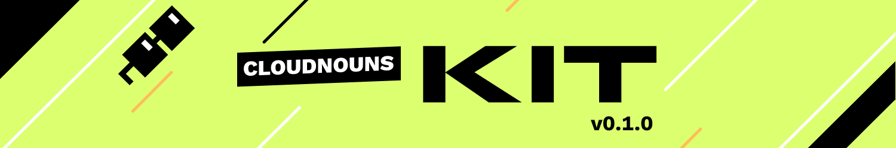

# 🌩 @cloudnouns/kit



The best way to build with [Nouns](https://nouns.wtf) and [Lil Nouns](https://lilnouns.wtf). ⌐◨-◨

@cloudnouns/kit is a JavaScript library that makes creating Nouns dead simple.

- 🔥 Create \*any\* Noun or Lil Noun.
- 👩🏽‍🔬 Choose all, some, or no traits. Or make Nouns with invisible traits.
- 🟩 Customize background colors
- 💝 Compatible with any frontend framework (like React, Vue, and Svelte) or vanilla JS.

> **Note**: Check out the Cloud API for a hosted, URL-based version of this library. Perfect for designers and no-code based workflows. [Learn more ↗️](https://docs.cloudnouns.com).

## Quick start

Install with your favorite package manager...

```bash
npm install @cloudnouns/kit
# or
yarn add @cloudnouns/kit
```

... import into your project...

```js
import { Noun } from '@cloudnouns/kit';
```

... initialize...

```js
// random Noun
const noun = new Noun();
```

... and use generously.

```jsx

```

### Try it out

Use the CodeSandbox links below to try out the library:

- [React](https://codesandbox.io/s/kit-example-react-7wgzhy?file=/src/MyNoun.js)
- [Svelte](https://codesandbox.io/s/kit-example-svelte-87vekr?file=/MyNoun.svelte)
- [Vue](https://codesandbox.io/s/kit-example-vue-2vuvkr?file=/src/MyNoun.vue)
- [Vanilla JS](https://codesandbox.io/s/kit-example-vanilla-sknszy?file=/src/index.js)

For more information, check out [our documentation](https://docs.cloudnouns.com).

## Noun Properties

| property | type     |                                                            |
| -------- | -------- | ---------------------------------------------------------- |
| `hex`    | `string` | hex color code. only set when `seed.background` equals `2` |
| `images` | `object` | keys: `svg` (data url)                                     |
| `seed`   | `object` | keys: `background`, `body`, `accessory`, `head`, `glasses` |
| `size`   | `number` | dimensions (square) of the image                           |
| `style`  | `string` | `classic` or `lil`                                         |
| `url`    | `string` | url for hosted image of the Noun                           |

### Example

```js
const noun = new Noun({
	traits: { head: 50, glasses: 7, background: 2 },
	hex: 'dcff70'
});

// noun.hex = 'dcff70'
// noun.images = { svg: 'data:image/svg+xml;base64...' }
// noun.seed = { background: 2, head: 50, glasses: 7, ... } (body & accessory chosen at random)
// noun.size = 320 (default)
// noun.style = 'classic' (default)
// noun.url = 'https://api.cloudnouns.com/v1/pfp?...`
```

[Preview this Noun in your browser!](https://api.cloudnouns.com/v1/pfp?background=2&head=50&glasses=7&hex=dcff70) Refresh the page for new combinations of the unspecified traits.

## Options

If no options are provided, a random Noun will be generated and returned.

| prop     | type                |                                            |
| -------- | ------------------- | ------------------------------------------ |
| `style`  | `string`            | `classic` or `lil`                         |
| `traits` | `object` or `array` | see below for example usage                |
| `text`   | `string`            | any text. used to generate Noun seed       |
| `hash`   | `string`            | must be a 0x-prefixed, valid, bytes32 hash |
| `hex`    | `string`            | must be a valid hex color code             |
| `size`   | `number`            | image dimensions (square)                  |

### Example usage

#### `style`

```js
// classic Noun
const noun = new Noun();
const noun2 = new Noun({ style: 'classic' });

// lil Noun
const lilnoun = new Noun({ style: 'lil' });
```

#### `traits`

```js
// each trait is optional. unspecified traits are chosen at random.

// partial object.
const noun = new Noun({
	traits: {
		head: 50,
		glasses: 7
	}
});

// full object
const noun2 = new Noun({
	traits: {
		background: 1,
		body: 15,
		accessory: 94,
		head: 138,
		glasses: 5
	}
});

// array. must include 5-valid values.
const noun3 = new Noun({ traits: [1, 15, 94, 138, 5] });
```

#### `text`

```js
// will always return the same Noun for a given string.
// below examples return 3 different Nouns
const noun = new Noun({ text: 'Badu Blanc' });
const noun2 = new Noun({ text: 'badublanc.eth' });
const noun3 = new Noun({ text: '@badublanc' });
```

#### `hash`

```js
// changes the hash used for Noun generation.
// must be a 0x-prefixed, valid, bytes32 hash.
// this prop is ignored without the text prop.
const ignored = new Noun({
	hash: '0x241aa473a95cb34fa4dc2d2c9b294ce9cc29a48b791f496b82341b937503fa69'
});

// produces two different Nouns due to hash, despite having same string
const noun = new Noun({ text: 'Badu Blanc' });
const noun2 = new Noun({
	text: 'Badu Blanc',
	hash: '0x241aa473a95cb34fa4dc2d2c9b294ce9cc29a48b791f496b82341b937503fa69'
});
```

#### `hex`

```js
// any valid hex color string
// ignored unless background is 2
const ignored = new Noun({ hex: 'c0fca6' });

const noun = new Noun({ traits: { background: 2 }, hex: 'c0fca6' });
const noun2 = new Noun({ traits: [2, 15, 3, 72, 10], hex: '79d4e0' });
```

#### `size`

```js
const small = new Noun({ size: 100 });
const large = new Noun({ size: 1000 });
```

### Combining props

```js
const customNoun = new Noun({
	traits: { background: 2, body: 13, accessory: 9, head: 23, glasses: 7 },
	hex: 'c0fca6',
	style: 'lil',
	size: 750
});
```
